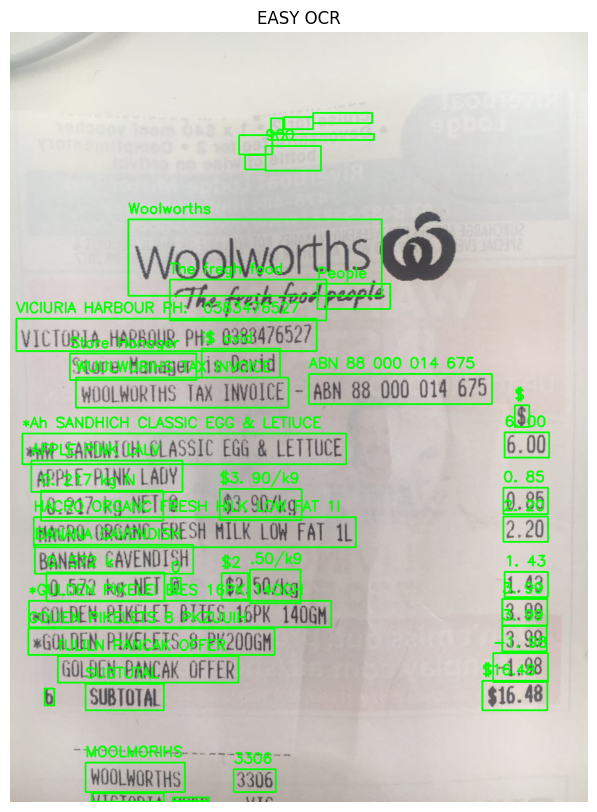

# OpenCV and Computer Vision mini projects
OpenCV Image, Video Processing,

# **Computer Vision Mini Projects**
### Object Tranking with Dense Optical
### Haar Casscode Object Detection
### Haar Casscode Face and Eye Detection
### Haar Casscode Vehicle Detection
### Text Extraction with Easy OCR and PyTesseract (Computer Vision && NLP)
